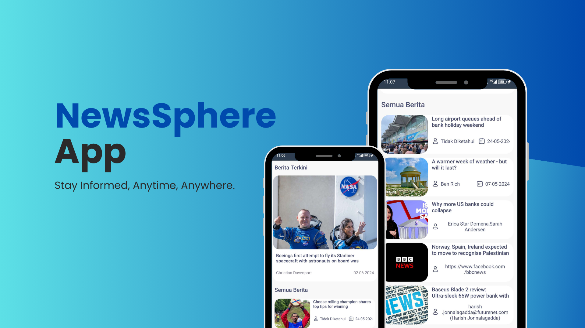

# NewsSphere

## About App
NewsSphere is a modern Android application designed to keep users informed with the latest news. With a sleek interface and intuitive design, the app allows users to explore top headlines and general news articles effortlessly. 

## Data Source
This application relies on [NewsAPI](https://newsapi.org/) to provide trusted and up-to-date news from reliable sources worldwide. NewsAPI is a robust platform for fetching news data, ensuring the content is accurate and relevant.

## Tech Stack
- **Programming Language**: Kotlin
- **Architecture Pattern**: MVVM (Model-View-ViewModel)
- **Networking**: Retrofit
- **Data Source**: [NewsAPI](https://newsapi.org/)

## Features
1. **Top Headlines**: Browse a curated list of trending and top news headlines from various reliable sources.
2. **General News**: Explore a comprehensive list of articles on diverse topics and categories.
3. **Real-Time Updates**: Fetch live data directly from NewsAPI for an up-to-date news feed.
4. **Clean Architecture**: Organized code structure using MVVM for better scalability and maintenance.

## How to Clone the Repository
Follow these steps to clone the project and set it up on your local machine:

1. **Clone the Repository**  
   Open your terminal or command prompt and run the following command:
   ```bash
   git clone https://github.com/<your-username>/NewsApp.git
   ```

2. **Open in Android Studio**
    - Launch **Android Studio** on your computer.  
    - Navigate to **File > Open** and select the directory where the repository was cloned.  
    - Choose the project folder and click **OK**.  

3. Sync Gradle Files
    - Once the project loads, Android Studio will prompt you to sync Gradle files.  
    - Click the **Sync Now** button to proceed.  

4. Add NewsAPI Key
    - Obtain your API key from [NewsAPI](https://newsapi.org/).  
    - Add the API key to the project:
   - Create a `local.properties` file (if it doesn't exist) or edit the existing one.  
   - Add the following line:  
     ```properties
     NEWS_API_KEY=your_api_key_here
     ```
   - Replace `your_api_key_here` with your actual NewsAPI key.  

5. Run the Application
    - Connect your Android device or launch an Android emulator.  
    - Click the **Run** button in Android Studio to build and run the app.  